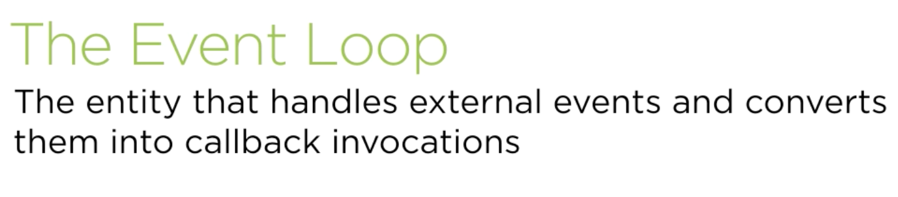
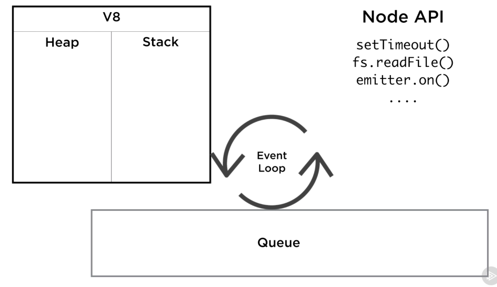
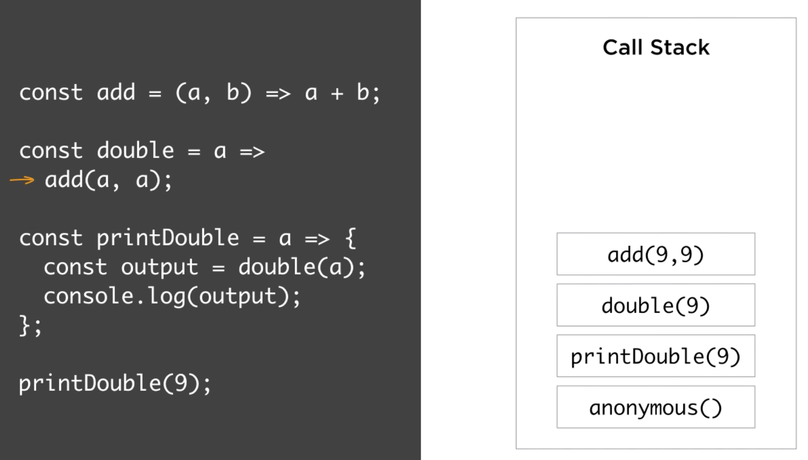
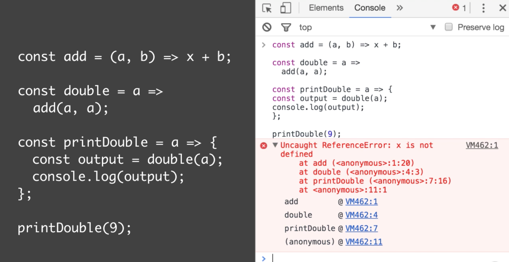
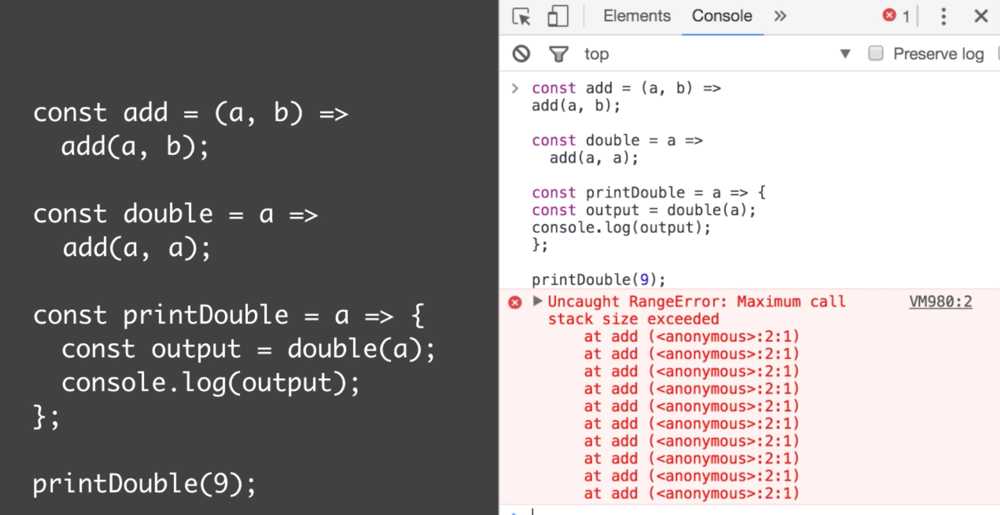
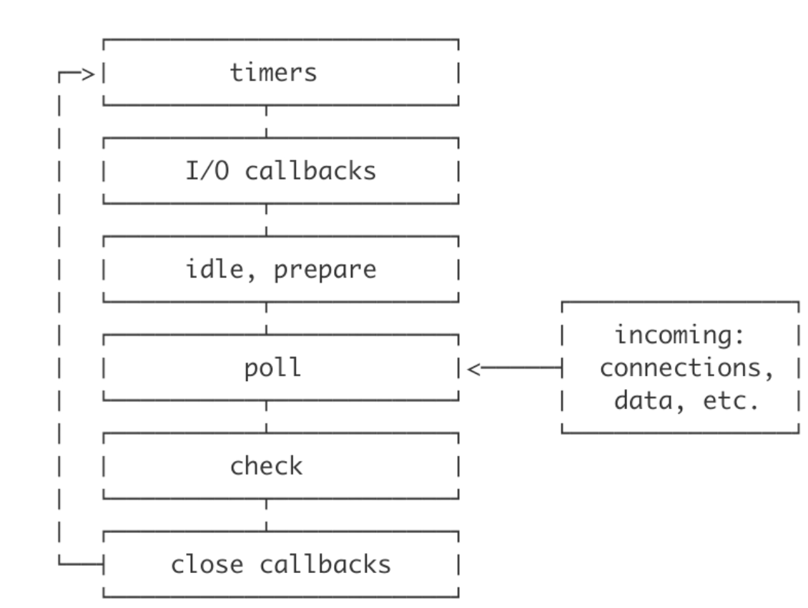
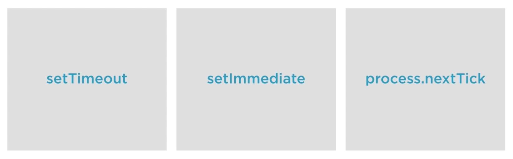

# Node.js Event loop

1. Event loop automatically starts on running node.js process
2. Event loop makes asynchronous programming style possible.
3. Node will exit from event loop when no more callback is left to process
4. Event loop is also present in browser and more less similar to Node.js

# Architecture

# v8 call stack

1. V8 call stack is simply a list of functions follows stack data structure i.e. first in last out
2. Since javascript is a single threaded, it can only do one thing at a time with single stack.
3. If stack is busy to execute something then nothing else will happen.
4. When V8 step into function then function get push into stack
5. When function return then it get pop out from stack
6. Every time we get error, browser/node show the call stack

Sample error when variable is not defined:

Sample error for infinite loop:

# How callback works?
<video width="320" height="240" controls>
  <source src="node-call-back.mov" type="video/mp4">
</video>

# callback lifecycle

# setTimeout vs setImmediate vs process.nextTick

# Function should be either sync or async
Use process.nextTick.
